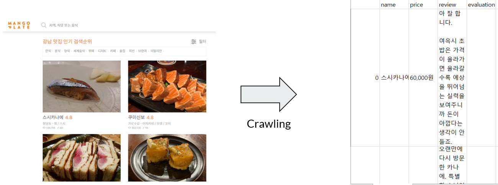
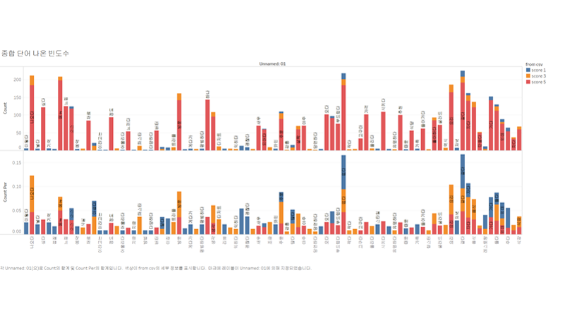
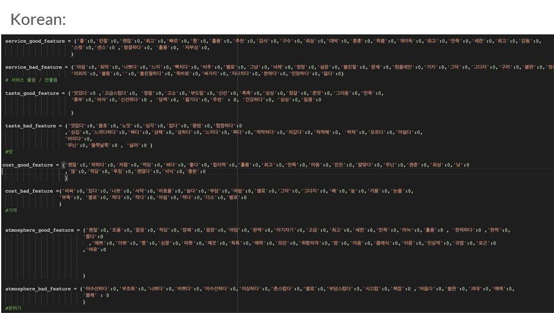

# 한국인 vs 외국인 맛집 리뷰 텍스트 분석

**목표 : 한국의 맛집 리뷰 플랫폼 '망고플레이트'와 외국인 대상 리뷰 플랫폼 '트립어드바이저'의 식당 리뷰를 비교 분석하여 내국인과 외국인 사이의 맛집의 관점 및 평가 기준 차이를 분석**

*   크롤링을 통해 맛, 가격, 서비스 품질, 분위기와 같운 요소들에 대한 평가가 들어가있는 리뷰 수집
*   TF-IDF을 활용해 수집한 데이터셋의 정확성 및 정보성을 파악
*   N-gram을 통해 텍스트 데이터 토크나이즈
*   나이브 베이즈 모델의 계수를 활용해 리뷰에서 중요하게 나오는 단어들을 분석
*   워드 클라우드를 통해 리뷰 데이터의 시각화를 통해 주요 키워드의 빈도를 파악
*   K-means 클러스터링을 통해 유사한 리뷰들을 그룹화하여, 한국인과 외국인 리뷰에서 드러나는 패턴 파악

## 크롤링

### 수집 사이트
*   [망고플레이트](https://www.mangoplate.com/) : 대한민국의 맛집 평가 애플리케이션 및 이를 운영하던 기업. 사용자가 직접 작성한 데이터 기반의 맛집 추천 서비스로 450만 이상 다운로드한 대표 맛집 플랫폼이었다.
*   [트립어드바이저](https://www.tripadvisor.co.kr/) : 세계 최대의 여행 플랫폼. 주로 호텔, 관광지, 음식점 등의 여행 관련 항목의 리뷰를 사용자들이 게시하는 사이트이며, 여행지 예약 등의 여행 관련 상업적 컨텐츠도 운영

### 수집 식당 지역
*   관광객 및 현지인 모두 많이 가는 서울의 강남 및 홍대

### 데이터셋
*   약 3,000개의 데이터셋(식당명, 리뷰 텍스트, 리뷰 평점(1,3,5))

## 리뷰 데이터 유용성 검증
*   텍스트 내의 단어나 문장들이 얼마나 중요한지 평가하기 위해 TF-IDF(Term Frequency-Inverse Document Frequency)를 사용
*   TF-IDF 점수는 특정 단어가 문서 집합 내에서 얼마나 중요한지를 나타내는 수치로 평가하여, 해당 단어가 문서나 문서 집합에서 얼마나 정보적 가치를 가지는지를 판단
*   TF-IDF는 단순한 빈도 수 기반 접근법과 달리, 단어의 문서 내 빈도와 전체 문서 집합에서의 희소성을 모두 고려

### 수식
TF(t) = n_t,d / Σn_w,d
- t: 특정 단어
- n_t,d: 문서 d에서 단어 t의 빈도수
- Σn_w,d: 문서 d에서 모든 단어의 빈도수 합

IDF(t) = log(N / n_t)
- N: 전체 문서의 수
- n_t: 단어 t가 포함된 문서의 수

TF-IDF(t) = TF(t) * IDF(t)

### TF-IDF 결과
TF-IDF score: 0.66(긍정/부정 리뷰를 구분하는 데 중요한 단어가 많지 않다는 것을 의미)

## N gram & Mapping Keywords of 4 features
*   N-gram : n개의 연속적인 단어 나열을 의미, 갖고 있는 코퍼스에서 n개의 단어 뭉치 단위로 끊어서 이를 하나의 토큰으로 간주
*   한국인과 외국인의 리뷰에서 맛, 서비스, 가격, 분위기와 관련된 특정 단어를 찾고 비교하기 위해 2-gram 적용

